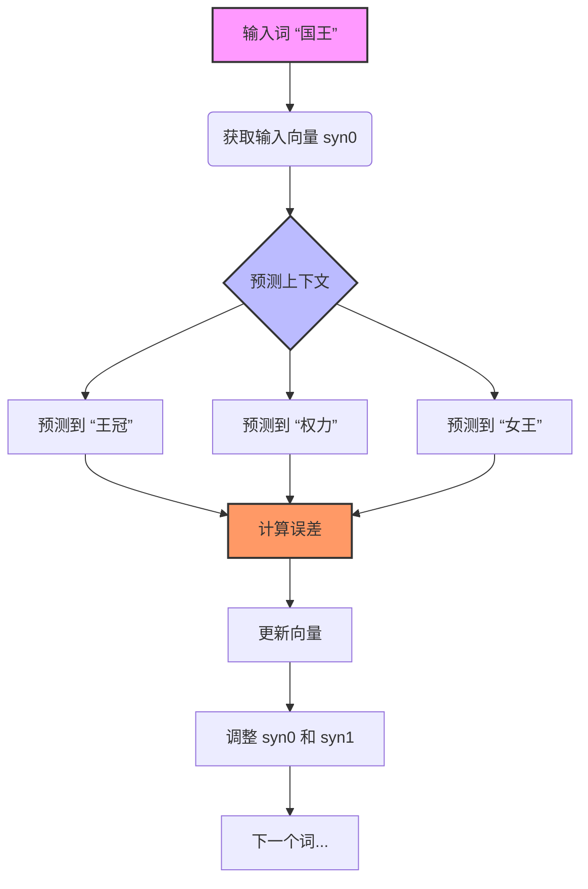

# 表示学习之Word2Vec

如何让计算机理解人类的自然语言？这一问题贯穿了自然语言处理（NLP）发展的整个历程。从早期的符号主义到统计方法，再到如今的深度学习范式，每一次跨越都源于对“词的意义如何被数学化表示”这一根本问题的重新思考。

---

## 一、N-gram模型：统计语言模型的基石

### 1.1 思想的源头：马尔科夫的启发

在20世纪初，概率论主要用于分析轮盘赌、抛硬币这类**相互独立**的事件。俄国数学家**安德烈·马尔科夫（Andrey Markov）** 则认为，现实世界中的很多事件是**相互关联**的——当前的状态会影响下一个状态。

为了证明这一点，他做了一个著名的实验：取普希金的小说《尤金·奥涅金》，去掉所有标点和空格，只留下前20,000个字母，统计其中元音和辅音的出现模式。他发现**43%是元音，57%是辅音**，且元音后面大概率跟着辅音，反之亦然。

这个实验的意义在于，它证明了**语言并非字母的随机分布，而是遵循着某种可以被建模的统计规律**。马尔科夫的工作，为后人提供了一种分析语言的全新数学工具。

### 1.2 香农的实验：用N-gram“预测”语言

1948年，克劳德·香农（Claude Shannon）发表了奠基性论文《通信的数学理论》，创立了**信息论（Information Theory）**。他将语言视为一个**信息源（information source）**，并首次用N-gram模型来研究语言的统计特性。

香农的核心思想是：**一个语言的“信息量”或“不确定性”，可以通过预测其下一个符号的难度来衡量**。他设计了一个“猜字母”实验，让受试者根据前文猜测下一个字母，并用N-gram模型来统计不同长度词序列的出现频率。

**N-gram**是指由N个连续的字母（或单词）组成的序列：

| 类型 | 定义 | 示例 |
|------|------|------|
| **1-gram (Unigram)** | 单个字母/单词 | “A”, “我” |
| **2-gram (Bigram)** | 两个连续单元 | “TH”, “我爱” |
| **3-gram (Trigram)** | 三个连续单元 | “THE”, “我爱你” |

香农发现，随着N的增加（即考虑更长的上下文），预测变得越来越准，熵值不断下降。英文的冗余度约为**50%**——这意味着在普通英文文本中，大约一半的字母是“多余的”。

20世纪80年代，随着计算能力的提升和大规模语料库的出现，N-gram模型迅速成为语音识别和机器翻译等系统的核心组件，标志着NLP从基于规则的“理性主义”向基于数据的“经验主义”的重大转变。

### 1.3 数学推导：从整句概率到N-gram

语言模型的核心任务是计算一个词序列的联合概率 \( P(w_1, w_2, ..., w_n) \)。直接统计整句频率面临**数据稀疏性（data sparsity）** 问题——几乎任何长句子在有限语料中都可能从未出现过。

**第一步：链式法则（Chain Rule）**

将联合概率分解为一系列条件概率的乘积：

$$
P(w_1, w_2, ..., w_n) = \prod_{i=1}^{n} P(w_i \mid w_1, ..., w_{i-1})
$$

**第二步：马尔可夫假设（Markov Assumption）**

这是N-gram模型诞生的最关键一步：**一个词出现的概率，只依赖于它前面出现的 N-1 个词**。

$$
P(w_i \mid w_1, ..., w_{i-1}) \approx P(w_i \mid w_{i-N+1}, ..., w_{i-1})
$$

代入链式法则，得到N-gram模型的核心公式：

$$
P(w_1, w_2, ..., w_n) \approx \prod_{i=1}^{n} P(w_i \mid w_{i-N+1}, ..., w_{i-1})
$$

**第三步：参数估计（最大似然估计）**

对于一个特定的N-gram，其概率估计为：

$$
P(w_i \mid w_{i-N+1}, ..., w_{i-1}) = \frac{\text{count}(w_{i-N+1}, ..., w_{i-1}, w_i)}{\text{count}(w_{i-N+1}, ..., w_{i-1})}
$$

### 1.4 平滑技术：解决零概率问题

MLE估计存在致命缺陷：如果某个N-gram在训练语料中**从未出现过**，其概率即为0。**平滑（Smoothing）** 技术应运而生。

**加一平滑（Add-one / Laplace Smoothing）**

假装每个N-gram都比实际多出现一次：

$$
P_{\text{Add-1}}(w_i \mid h) = \frac{\text{count}(h, w_i) + 1}{\text{count}(h) + V}
$$

其中 \( V \) 为词汇表大小。优点：极其简单。缺点：给未出现词分配过多概率。

**古德-图灵估计（Good-Turing Estimation）**

核心思想：“用我们观察到的总次数，来估计未观察到的事物的总次数。”对于出现 \( r \) 次的事件：

$$
r^* = (r+1) \times \frac{N_{r+1}}{N_r}
$$

其中 \( N_r \) 为恰好出现 \( r \) 次的N-gram数量。

**回退模型（Backoff）**

如果高阶N-gram计数为零，就“回退”到低阶N-gram。代表性算法为**Katz回退**。

**插值模型（Interpolation）**

始终将高阶、低阶N-gram的概率进行**加权线性组合**：

$$
P_{\text{interp}}(w_i \mid h) = \lambda_3 P_3 + \lambda_2 P_2 + \lambda_1 P_1
$$

**Kneser-Ney 平滑**

目前性能最优的方法。它不只看低阶N-gram的频率，而是考虑其**延续概率**——即一个词在多少种不同上下文中出现过。

### 1.5 N-gram的局限

N-gram模型是统计自然语言处理的**基石（cornerstone）**，但也存在显著局限：上下文窗口固定，无法捕捉长距离依赖；数据稀疏问题依然存在；**缺乏语义理解**——无法识别“猫”和“狗”是相似的动物。

---

## 二、Word2Vec：从离散符号到连续向量空间

N-gram模型将词视为原子符号，无法捕捉词与词之间的语义关系。2013年，Google的Tomas Mikolov团队提出了**Word2Vec**，从根本上改变了词表示的方式。

### 2.1 两篇奠基性论文

Word2Vec的核心思想主要阐述于两篇论文：

**论文一：《Efficient Estimation of Word Representations in Vector Space》**（arXiv:1301.3781）

发表于2013年1月，作者为Tomas Mikolov、Kai Chen、Greg Corrado和Jeffrey Dean。这篇论文提出了两种用于从大规模数据集中计算词连续向量表示的**新型模型架构**。论文的核心目标是引入能够从数十亿词、数百万词汇量的大数据集中学习高质量词向量的技术。实验表明，这些向量在句法和语义词相似性测试中达到了**当时最先进的性能**，且仅需不到一天即可从16亿词的数据集中学习到高质量词向量。

**论文二：《Distributed Representations of Words and Phrases and their Compositionality》**（arXiv:1310.4546）

发表于2013年10月，作者为Tomas Mikolov、Ilya Sutskever、Kai Chen、Greg Corrado和Jeffrey Dean。这篇论文提出了多项扩展，**同时提升了向量质量和训练速度**。论文详细描述了**负采样（Negative Sampling）** 作为层次Softmax的替代方案，以及**高频词下采样（Subsampling of Frequent Words）** 技术。

### 2.2 核心思想：让“语义”可以被计算

Word2Vec的理论基础是语言学中的**“分布式假设”（Distributional Hypothesis）**：**“一个词的含义由其周围的词所决定”**（You shall know a word by the company it keeps）。

Word2Vec的突破性在于，它证明了语义关系可以通过简单的数学向量运算来体现：

$$
\text{vec(“国王”) - vec(“男人”) + vec(“女人”) ≈ vec(“女王”)}
$$

这种特性意味着：**语义相近的词在向量空间中距离更近，且向量之间的加减运算能够捕捉词语间的语义关系**。

Mikolov等人在论文中明确指出，他们期望“**相似的词不仅倾向于彼此靠近，而且词可以具有多种程度的相似性**”。他们在词向量空间中发现了**线性正则性（linear regularities）**，例如通过简单的向量运算可以解决诸如“国家-首都”等类比推理问题。

### 2.3 两种模型架构

Word2Vec包含两种主要模型架构：

**CBOW（连续词袋模型，Continuous Bag-of-Words）**

CBOW的目标是**根据上下文来预测中心词**：

```
[word(t-2), word(t-1), word(t+1), word(t+2)] → word(t)
```

CBOW将上下文词的向量表示**聚合（通常是求平均）**，然后预测中心词。其优势在于：小规模语料库训练更快；对高频词效果更好。

**Skip-gram（跳字模型）**

Skip-gram与CBOW相反，目标是**根据中心词来预测其上下文**：

```
word(t) → [word(t-2), word(t-1), word(t+1), word(t+2)]
```

Skip-gram的优势在于：**大规模语料库效果更好；对稀有词的表现更优**。

两种模型都在贯彻同一件事：**用局部上下文去预测词，从而把语义统计信息压缩进向量**。

Mikolov等人在论文中通过实验证明，基于神经网络的分布式表示模型**显著优于N-gram模型**。

### 2.4 训练优化技术

完整的softmax需要对整个词汇表（可能数百万词）计算概率，计算量巨大。第二篇论文提出了两项关键优化：

**高频词下采样（Subsampling of Frequent Words）**

像“的”、“是”这类高频词出现频繁但信息量少。训练时以一定概率“忽略”这些词，**显著加快训练速度，同时让词向量质量更好**。

**负采样（Negative Sampling）**

负采样不计算所有词的精确概率，而是**只更新一个“正样本”和随机挑选的几个“负样本”**。

> 负采样的核心思想是：**最大化上下文词之间的相似度，同时最小化非上下文词之间的相似度**。

它将昂贵的多分类问题**近似为一组二分类判断**：让模型学会区分“真实上下文词”和“随机采样的噪声词”。这使训练复杂度大幅下降，让Word2Vec**真正成为可在工业语料上高效运行的工具**。

**层次Softmax（Hierarchical Softmax）**

将词汇表构建为一棵**霍夫曼树（Huffman Tree）**，将多分类问题转化为沿树的路径进行的一系列二分类问题，将词汇表大小对时间复杂度的影响降为常数。

### 2.5 源代码解析

Google开源了Word2Vec的C语言实现，可从GitHub获取。核心数据结构：

- **`syn0`**：词的**输入向量**。作为中心词输入时使用，随机初始化。
- **`syn1` / `syn1neg`**：词的**输出向量**。作为上下文词被预测时使用，初始化为零。

训练主循环：

1. **读取一个词**作为“中心词”`w`
2. **获取上下文**：找出`w`周围窗口内的词
3. **前向传播**：Skip-gram用`w`的`syn0`预测上下文词；CBOW用上下文词`syn0`的平均值预测中心词
4. **计算误差**：对比预测与真实结果
5. **反向传播**：调整`syn0`和`syn1/syn1neg`
6. **重复**直到遍历完整个文本

### 2.6 训练过程示意图



### 2.7 流行实现

- **Gensim（Python）**：最流行的实现，提供高层API
- **官方C语言实现**：效率最高，适合Linux/macOS
- **PyTorch/TensorFlow实现**：便于理解模型细节和二次开发

---

## 三、总结

| 对比维度 | N-gram | Word2Vec |
|----------|--------|----------|
| **词表示方式** | 离散符号 | 连续稠密向量 |
| **语义捕捉** | 无法识别词义相似性 | 语义相似词在空间中靠近 |
| **上下文建模** | 固定长度N-gram | 可变窗口（Skip-gram/CBOW） |
| **数据稀疏问题** | 严重，需平滑 | 大幅缓解 |
| **泛化能力** | 弱 | 强 |

Word2Vec通过其精巧的设计，将离散的语言符号映射到连续的向量空间，让这个空间中的数学运算能够反映词语之间的语义和语法关系。它让“语义”不再是一个抽象标签，而是被具体落实为**预测任务中的可利用结构**。

---

## 参考文献

[1] Mikolov, T., Chen, K., Corrado, G., & Dean, J. (2013). Efficient Estimation of Word Representations in Vector Space. *arXiv preprint arXiv:1301.3781*. 

[2] Mikolov, T., Sutskever, I., Chen, K., Corrado, G. S., & Dean, J. (2013). Distributed Representations of Words and Phrases and their Compositionality. *arXiv preprint arXiv:1310.4546*. 

[3] Rong, X. (2014). word2vec Parameter Learning Explained. *arXiv preprint arXiv:1411.2738*. 

---

> **AI参与声明**：本文档在撰写过程中使用了AI辅助工具进行内容整理、格式优化与润色。所有核心概念与论文引用均基于原始学术文献与公开资料，并经人工校验与补充。