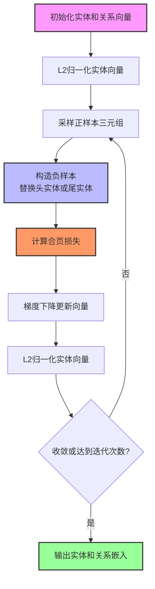

# 表示学习之TransE

如何让计算机理解知识图谱中的实体和关系？这一问题推动了知识图谱表示学习（Knowledge Graph Embedding, KGE）的发展。从早期的张量分解到基于神经网络的模型，再到基于翻译的嵌入方法，每一次演进都源于对“如何将符号化的知识转化为可计算的向量”这一根本问题的重新思考。

---

## 一、背景：多关系数据建模的挑战

在社交网络、推荐系统和知识图谱等应用中，数据本质上是由**实体（Entities）** 和**关系（Relationships）** 构成的多关系数据（Multi-relational Data）。这类数据的特点是：

- **实体类型多样**：可能包含数百万个不同的实体
- **关系类型复杂**：关系可以是1对1、1对多、多对1或多对多
- **数据规模巨大**：现实世界的知识图谱可能包含数十亿个三元组

传统方法（如单层模型、神经张量网络 NTN 等）虽然能够建模多关系数据，但普遍存在**训练复杂、参数过多、难以扩展**等问题。

---

## 二、原始论文

TransE 算法的原始论文是：

> **标题**：*Translating Embeddings for Modeling Multi-relational Data*
> **作者**：Antoine Bordes, Nicolas Usunier, Alberto Garcia-Durán, Jason Weston, Oksana Yakhnenko
> **发表会议**：NIPS 2013 (Neural Information Processing Systems)
> **论文链接**：[NIPS Proceedings](https://proceedings.neurips.cc/paper/2013/hash/1cecc7a77928ca8133fa24680a88d2f9-Abstract.html)

**论文摘要**：

> 我们考虑将多关系数据的实体和关系嵌入到低维向量空间中的问题。我们的目标是提出一个易于训练的规范模型，该模型包含较少的参数，并且可以扩展到非常大的数据库。因此，我们提出了 **TransE**，一种通过将关系解释为对实体低维嵌入进行**平移（translation）** 操作来建模关系的方法。尽管它很简单，但这个假设被证明是强大的——大量实验表明，TransE 在两个知识库的链接预测任务上显著优于最先进的方法。此外，它可以在包含 100 万个实体、25,000 个关系和超过 1700 万个训练样本的大规模数据集上成功训练。

---

## 三、核心思想：关系即平移

TransE 的核心思想受到 **Word2Vec** 中词向量平移不变性的启发。它的基本假设极其简洁：

> **对于知识图谱中的每个事实三元组（头实体 h，关系 r，尾实体 t），TransE 希望头实体的向量加上关系的向量约等于尾实体的向量。**

用公式表示就是：

$$
\mathbf{h} + \mathbf{r} \approx \mathbf{t}
$$

**直观理解**：如果把实体看作向量空间中的“点”，那么关系就是这个空间中从“头实体”指向“尾实体”的一个**平移向量**（Translation Vector）。

例如，如果存在事实 `(中国, 首都, 北京)`，那么 TransE 希望：

$$
\text{vec(中国)} + \text{vec(首都)} \approx \text{vec(北京)}
$$

这意味着，在向量空间中，“中国”沿着“首都”这个方向平移一段距离后，就应该到达“北京”的位置。

---

## 四、数学模型

### 4.1 打分函数（能量函数）

对于三元组 $(h, r, t)$，TransE 定义了一个**打分函数**（或称能量函数）来衡量该三元组成立的可能性：

$$
f_r(h, t) = \| \mathbf{h} + \mathbf{r} - \mathbf{t} \|_{L1/L2}
$$

其中：

- $\mathbf{h}$：头实体的嵌入向量
- $\mathbf{r}$：关系的嵌入向量
- $\mathbf{t}$：尾实体的嵌入向量
- $\|\cdot\|$：L1 或 L2 范数

**分数越低，表示该三元组成立的可能性越高**。在理想情况下，对于正确的三元组，我们希望 $\mathbf{h} + \mathbf{r} = \mathbf{t}$，此时分数为 0。

### 4.2 损失函数

TransE 使用**合页损失函数（Hinge Loss）** 进行训练：

$$
\mathcal{L} = \sum_{(h,r,t) \in S} \sum_{(h',r,t') \in S'} \max(0, \gamma + f_r(h, t) - f_r(h', t'))
$$

其中：

- $S$：正样本集合（知识图谱中真实存在的三元组）
- $S'$：负样本集合（通过替换头实体或尾实体构造的错误三元组）
- $\gamma$：间隔超参数（margin），控制正负样本之间的最小距离
- $f_r(h, t)$：正样本的分数
- $f_r(h', t')$：负样本的分数

损失函数的优化目标可以通俗地理解为：**让正确三元组的分数尽量低（距离小），让错误三元组的分数尽量高（距离大），并且两者之间至少保持 $\gamma$ 的间隔**。

### 4.3 负采样策略

论文中采用的负样本构造方式是：**固定关系，随机替换头实体或尾实体**。即，对于一个正样本 $(h, r, t)$，负样本可以构造为 $(h', r, t)$ 或 $(h, r, t')$，其中 $h'$ 和 $t'$ 是从所有实体中随机采样的。

这种策略的直观原因是：在知识图谱中，给定一个关系和尾实体，正确的头实体是稀有的；给定一个关系和头实体，正确的尾实体也是稀有的。随机替换通常会产生错误的三元组，因此可以作为有效的负样本。

---

## 五、训练过程

TransE 的训练过程如下：

1. **初始化**：为所有实体和关系随机初始化低维向量（通常使用均匀分布或正态分布）

2. **归一化**：对实体向量进行 L2 归一化，使其范数为 1

3. **采样批量**：从训练集中采样一批正样本

4. **构造负样本**：对每个正样本，通过替换头实体或尾实体构造对应的负样本

5. **计算损失**：使用合页损失函数计算当前批次的损失

6. **梯度下降**：使用随机梯度下降（SGD）更新实体和关系的向量

7. **重复**：迭代步骤 3-6，直到达到预设的迭代次数或损失收敛

**训练过程的约束**：为了防止训练过程通过单纯增加实体向量的范数来最小化损失，TransE 在每次更新后对实体向量进行 L2 归一化。

---

## 六、训练过程示意图



---

## 七、实验与评估

### 7.1 评估任务

论文在两个标准任务上评估了 TransE 的性能：

1. **链接预测（Link Prediction）**：给定三元组中的两个元素，预测缺失的第三个元素。例如，给定 $(h, r, ?)$ 预测尾实体，或给定 $(?, r, t)$ 预测头实体。

2. **三元组分类（Triplet Classification）**：判断给定的三元组 $(h, r, t)$ 是否成立。

### 7.2 数据集

论文使用了两个标准知识图谱数据集：

| 数据集 | 实体数 | 关系数 | 训练三元组 | 描述 |
|--------|--------|--------|------------|------|
| **WN18** | 40,943 | 18 | 141,442 | WordNet 的子集，包含词汇间的语义关系 |
| **FB15K** | 14,951 | 1,345 | 483,142 | Freebase 的子集，包含电影、人物等事实 |

论文还在大规模数据集 **FB1M**（100 万实体，25,000 关系，1700 万训练样本）上进行了可扩展性测试。

### 7.3 主要结果

实验结果表明，TransE 在链接预测任务上显著优于当时的最先进方法。模型的简洁性不仅没有损害性能，反而通过减少参数、加速训练带来了更好的泛化能力。

---

## 八、优点与局限性

### 8.1 优点

| 优点 | 说明 |
|------|------|
| **模型简洁** | 参数少，易于理解和实现 |
| **训练高效** | 可扩展到包含数百万实体和数十亿三元组的大规模数据集 |
| **性能优秀** | 在链接预测等任务上显著优于当时的最先进方法 |
| **可解释性强** | 关系的“平移”解释直观，便于理解 |

### 8.2 局限性

| 局限性 | 说明 |
|--------|------|
| **处理复杂关系模式能力有限** | 在处理 1-to-N、N-to-1、N-to-N 等复杂关系时表现不佳 |
| **无法建模对称/反对称关系** | 对于对称关系（如“相似”），TransE 可能导致冲突的约束 |
| **同一关系的多个三元组可能冲突** | 如果同一关系连接多个头实体和尾实体，$h + r \approx t$ 的约束可能无法同时满足 |

---

## 九、源代码

TransE 作为经典算法，有多种开源实现。以下是一些推荐：

### 9.1 PyKEEN（推荐）

PyKEEN 是一个功能完整的 Python 知识图谱嵌入库，支持 TransE 等多种模型：

```python
from pykeen.pipeline import pipeline

# 在 Nations 数据集上训练和评估 TransE 模型
result = pipeline(
    dataset='nations',
    model='TransE',
    training_loop='sLCWA',
    negative_sampler='basic',
    epochs=100,
)
```

### 9.2 DGL-KE

Deep Graph Library 提供的知识图谱嵌入工具包：

```python
import dgl
import torch as th
from dgl.nn import TransE

# 定义模型
num_nodes = 10
num_rels = 3
embed_dim = 128
model = TransE(num_nodes, num_rels, embed_dim)
```

### 9.3 个人/社区实现

- **NumPy / PyTorch 实现**：仓库 `CharlesZhuRen/TransE`，代码结构清晰，适合初学者理解算法细节
- **KGRL 框架**：基于 PyTorch Lightning，支持 TransE、TransH、TransR 等多种模型

---

## 十、总结

TransE 通过其精巧的设计，将知识图谱中的符号化知识映射到连续的向量空间，让向量之间的数学运算能够反映实体之间的语义关系。它的核心贡献在于：

1. **“关系即平移”的简洁假设**：$\mathbf{h} + \mathbf{r} \approx \mathbf{t}$

2. **高效的训练方法**：合页损失 + 负采样 + SGD

3. **优秀的可扩展性**：可处理百万级实体和千万级三元组

尽管 TransE 在处理复杂关系模式时存在局限性，但它作为知识图谱嵌入的**基准模型（baseline）**，为后续的 TransH、TransR、RotatE 等一系列模型奠定了基础，是知识图谱表示学习领域不可绕过的里程碑。

---

## 参考文献

[1] Bordes, A., Usunier, N., Garcia-Durán, A., Weston, J., & Yakhnenko, O. (2013). Translating Embeddings for Modeling Multi-relational Data. In *Advances in Neural Information Processing Systems (NIPS 2013)*, pp. 2787-2795.

[2] Bordes, A., Usunier, N., Garcia-Durán, A., Weston, J., & Yakhnenko, O. (2013). Translating Embeddings for Modeling Multi-relational Data. *arXiv preprint*.

---

> **AI参与声明**：本文档在撰写过程中使用了AI辅助工具进行内容整理、格式优化与润色。所有核心概念与论文引用均基于原始学术文献与公开资料，并经人工校验与补充。